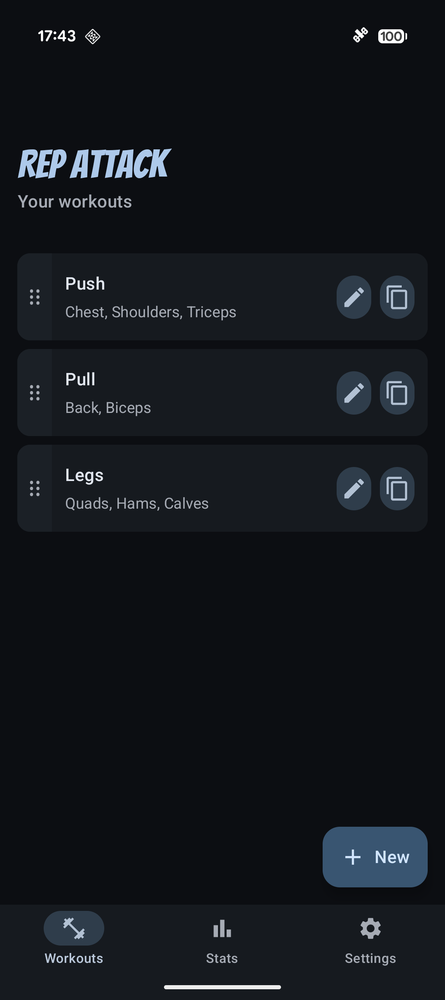
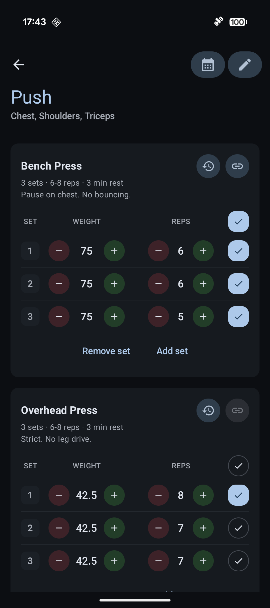
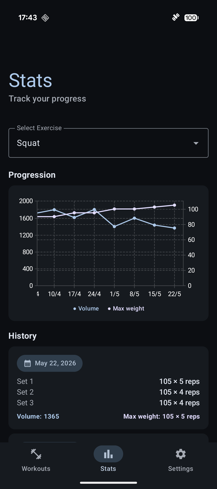
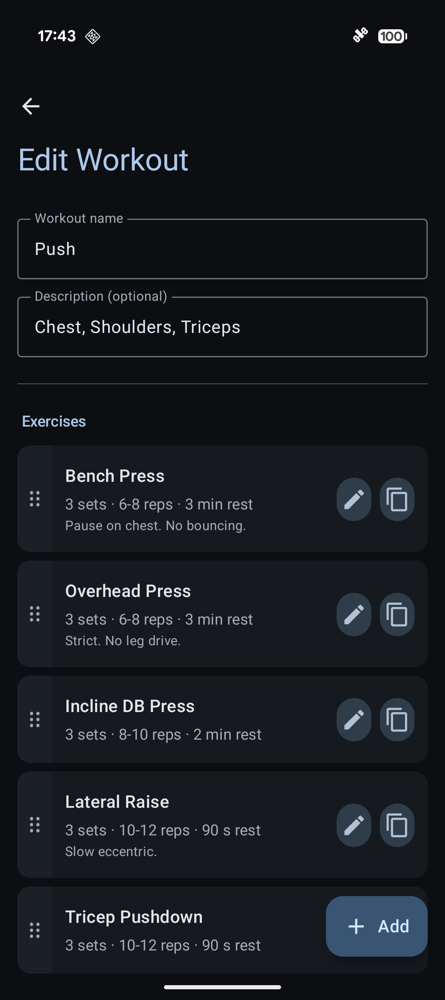
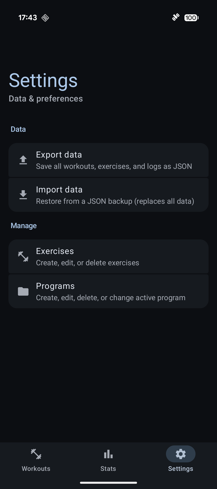
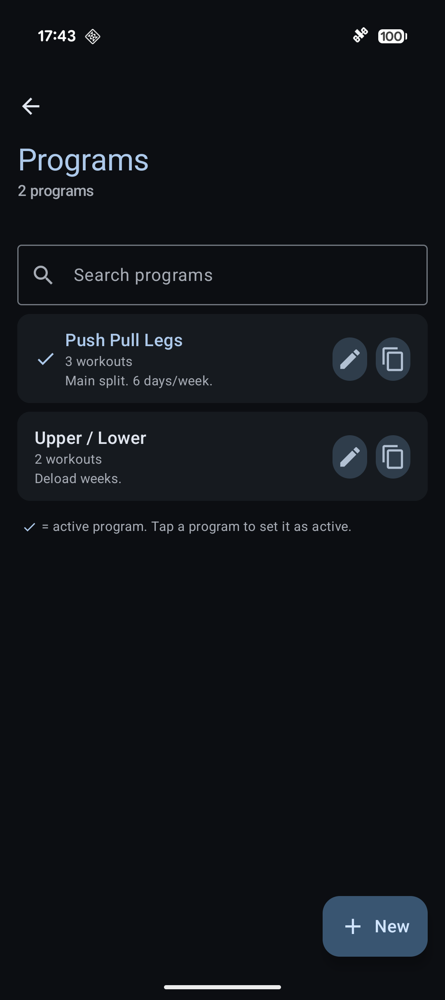
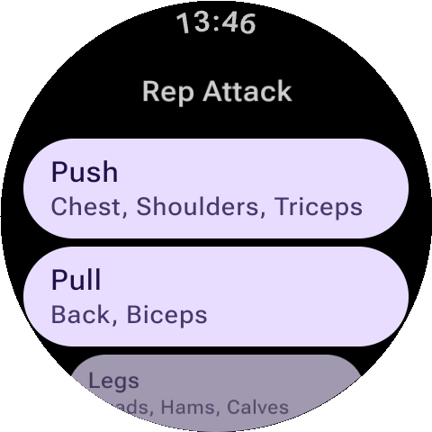
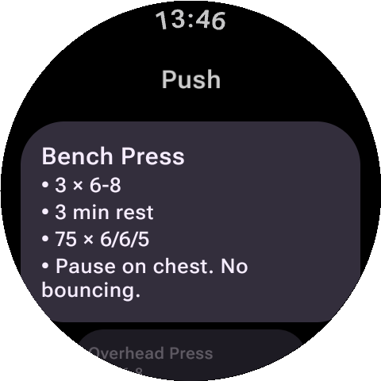
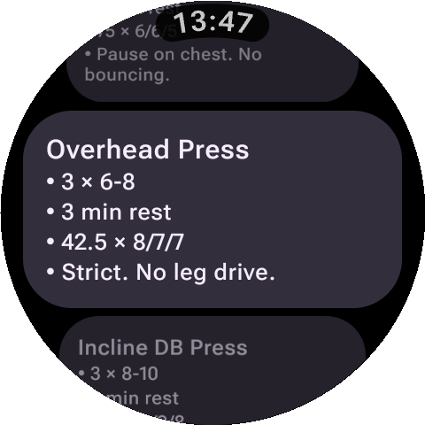

<div align="center">


**A clean, offline gym tracker for Android — with a Wear OS companion app.**

Plan your workouts, log every set in seconds, and watch your numbers go up.
No accounts. No ads. No tracking. Ever.


[](LICENSE)

<a href="https://github.com/yashbellam97/RepAttack/releases/latest">
  
</a>

</div>

---

## Why Rep Attack?

Most gym apps want your email, your subscription, and your attention. Rep Attack just wants to help you lift.

- 🏋️ **Built for the gym floor.** Big buttons, plus/minus steppers, one-tap set completion — log a full session without ever touching the keyboard.
- 📈 **See your progress.** Per-exercise charts for max weight and volume make plateaus and PRs obvious at a glance.
- 📅 **Plan ahead.** Group exercises into workouts and workouts into programs. Edit workouts or switch programs anytime without losing exercise history.
- ⌚ **Glance at your routine.** A companion Wear OS app shows your workout on your wrist.
- 🔒 **Private by design.** Everything is stored locally. Back up and restore via JSON whenever you want.
- 🎨 **Looks great.** Material 3 Expressive, dynamic color on Android 12+, and spring-physics motion throughout.
- 📳 **Feels great.** Tuned haptic feedback on every meaningful action — set completion, swipes, drag handles, delete confirmations.

---

## Screenshots

<div align="center">

### On your phone

<table>
  <tr>
    <td></td>
    <td></td>
    <td></td>
  </tr>
  <tr>
    <td></td>
    <td></td>
    <td></td>
  </tr>
</table>

### On your wrist

<table>
  <tr>
    <td></td>
    <td></td>
    <td></td>
  </tr>
</table>

</div>

---

## Building from source

Want to hack on it or build your own APK? You'll need a recent Android Studio and JDK 11.

```bash
git clone https://github.com/yashbellam97/RepAttack.git
cd RepAttack
./gradlew :app:installDebug    # phone app
./gradlew :wear:installDebug   # wear os companion
```

<details>
<summary><b>Tech stack (for the curious)</b></summary>

- **Kotlin** 2.1 + **Jetpack Compose** with **Material 3 Expressive**
- **Room** for the local database (MVVM, `StateFlow` everywhere)
- **Vico** for charts
- **sh.calvin.reorderable** for drag-and-drop
- **kotlinx.serialization** for the backup format
- **Wear Data Layer** for phone → watch sync

Modules:

- `app/` — phone app
- `shared/` — DTOs shared with the watch
- `wear/` — Wear OS companion

</details>

---

## License

Rep Attack is released under the **GNU General Public License v3.0**. See [LICENSE](LICENSE) for the full text.

In short: you're free to use, modify, and distribute the app, but any distributed fork must also be open source under the same license. This keeps Rep Attack — and any version of it that reaches users — free forever.
